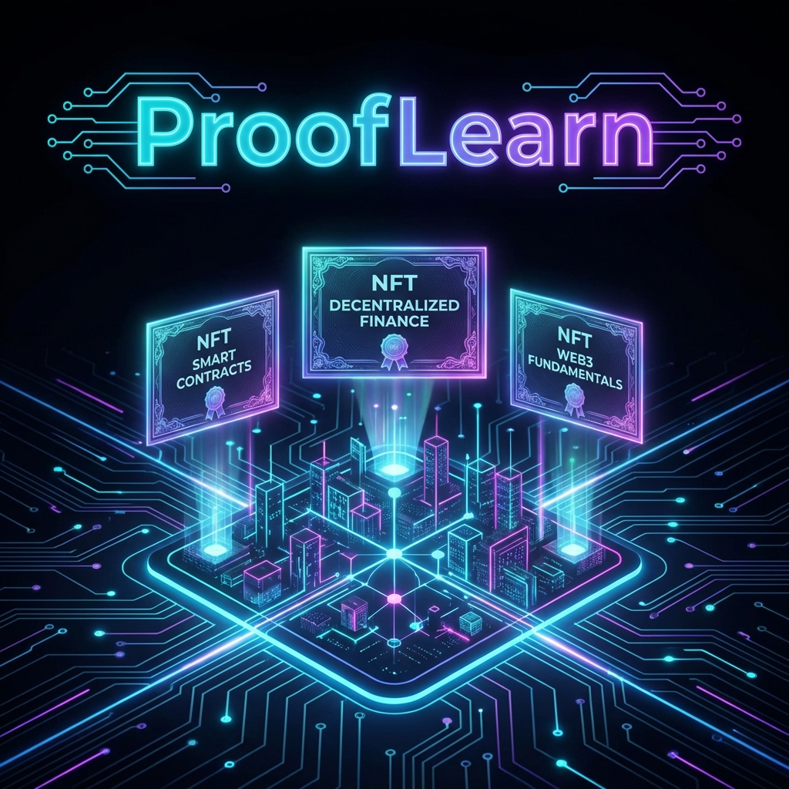
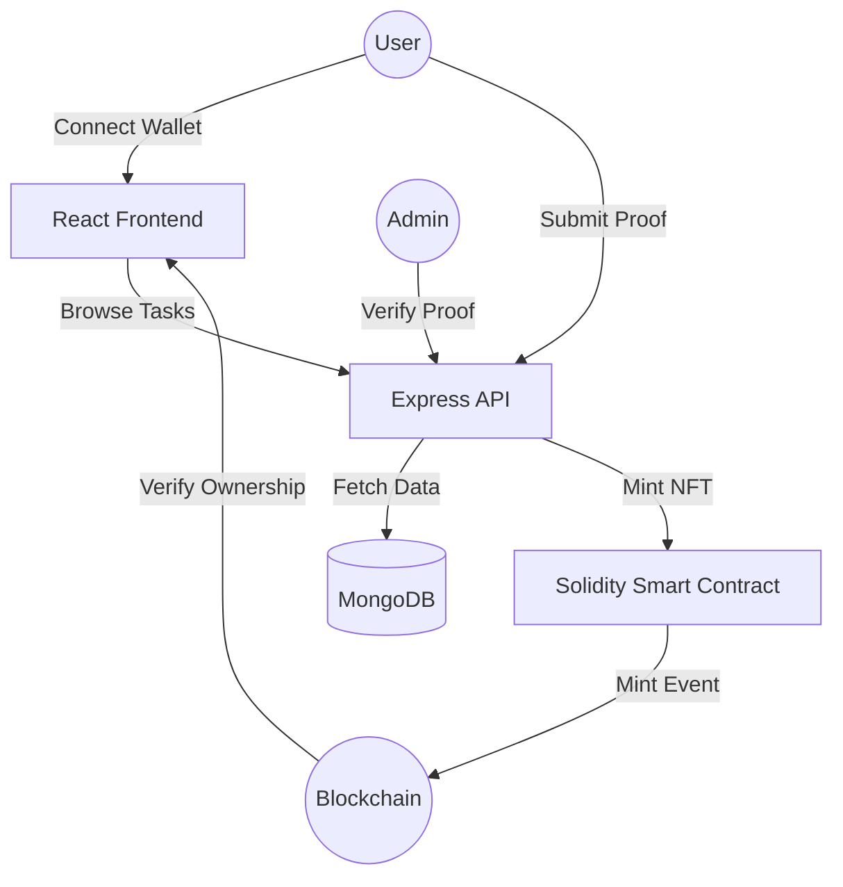

# 🌐 ProofLearn: The On-Chain Skill Verification Platform



## 🚀 Vision
**ProofLearn** is a futuristic, decentralized learning management system (LMS) designed to bridge the gap between skill acquisition and professional recognition. In a world where tradtional resumes are becoming obsolete, ProofLearn provides a **verification layer for the next generation of Web3 talent.**

By completing real-world missions, users earn immutable **NFT Certificates** that serve as cryptographic proof of their expertise, directly on the blockchain.

---

## ✨ Key Features

- **💎 Skill Missions**: Real-world technical challenges from top Web3 projects.
- **🛡️ Human-in-the-Loop Verification**: Dual-layer review process (AI + Experts) ensures only high-quality work is minted.
- **🔐 Secure SIWE Authentication**: Cryptographic login protection to prevent identity spoofing.
- **📜 Soulbound-Style Credentials**: Earn non-transferable NFT certificates that build your on-chain resume.
- **🎨 Futuristic UI**: A premium, glassmorphic design system built for the modern Web3 user.
- **⚡ Real-time Feedback**: Instant submission tracking and state-of-the-art animations via Framer Motion.

## 🎮 How It Works (For Strangers!)

1.  **Login with Wallet**: Click "Connect Wallet" and sign the secure SIWE message to create your account.
2.  **Explore Missions**: Browse the Marketplace for challenges (e.g., "Deploy a Smart Contract").
3.  **Submit Proof**: Paste the URL of your work (Github/Etherscan) to submit.
4.  **Get Verified**: Once approved, your XP increases and you mint a **Soulbound NFT** automatically.
5.  **Build Reputation**: Watch your "Skill Graph" grow on your Profile page as you master more skills!

4.  **Admin Setup (Optional)**
    To access the Curator Panel, you must promote your wallet address to Admin:
    ```bash
    # Run from root directory
    node prooflearn/backend/scripts/make-admin.js <YOUR_WALLET_ADDRESS>
    ```

---

## 🛠️ Tech Stack

### Frontend
- **Framework**: React.js 18 (Vite)
- **Styling**: Tailwind CSS (Custom Design System)
- **Animations**: Framer Motion
- **Icons**: Lucide React
- **Web3**: Ethers.js (v6)

### Backend
- **Runtime**: Node.js & Express
- **Database**: MongoDB (Mongoose)
- **Blockchain Interface**: Ethers.js
- **Environment**: Dotenv for secure key management

### Smart Contracts
- **Language**: Solidity (^0.8.20)
- **Standards**: ERC721 (NFT) with URI Storage
- **Development**: Hardhat
- **Security**: OpenZeppelin Contracts

---

## 🏗️ Project Architecture



---

## ⚙️ Quick Start

### Prerequisites
- Node.js (v18+)
- Python 3.8+ (For AI Service)
- MongoDB (Running locally or via Atlas)
- MetaMask Extension

### Installation

1.  **Clone & Install**
    ```bash
    git clone https://github.com/sohansarkar07/ProofLearn.git
    cd ProofLearn
    npm run install-all
    pip install -r prooflearn/ai-service/requirements.txt
    ```

2.  **Environment Setup**
    Create a `.env` file in `prooflearn/backend/` and `prooflearn/frontend/`:
    ```bash
    # Backend .env
    PORT=5000
    MONGODB_URI=your_mongodb_uri
    PRIVATE_KEY=your_admin_wallet_private_key
    SEPOLIA_RPC_URL=your_rpc_url
    ```
    Create a `.env` in `prooflearn/ai-service/` for the AI Engine:
    ```bash
    GROQ_API_KEY=your_groq_api_key
    ```

3.  **Run the Project**
    Launch frontend, backend, and AI service:
    ```bash
    npm run dev
    # This automatically starts Frontend (Port 5173), Backend (Port 5000), and AI Service (Port 5001)
    ```

---

## 🗺️ Roadmap
- [x] **Skill Graph**: Visual representation of user expertise levels.
- [x] **AI Learning Assistant**: Integrated tutor for mission guidance.
- [x] **Gamification Layer**: XP-based levels and leaderboard.
- [ ] **Multi-chain Support**: Deploying certificates across Mantle, Polygon, and Sepolia.

---

## 📄 License
This project is licensed under the MIT License - see the LICENSE file for details.

---

<p align="center">
  Built with ☕ and ⚡ by the ProofLearn Team
</p>